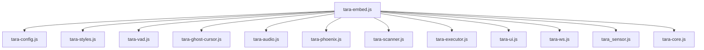

# TARA Widget Modular Rewrite — Walkthrough

## What Changed

The monolithic 3275-line [tara-widget.js](file:///Users/amar/demo.davinciai/orchestra_daytona.v2/static/tara-widget.js) was decomposed into **12 focused modules** (3445 total lines across all files). The original file is archived as `tara-widget.js.bak`.

## Module Inventory

| Module | Lines | Purpose |
|---|---|---|
| [tara-config.js](file:///Users/amar/demo.davinciai/orchestra_daytona.v2/static/tara-config.js) | 122 | Env detection, defaults, constants, orb cache |
| [tara-styles.js](file:///Users/amar/demo.davinciai/orchestra_daytona.v2/static/tara-styles.js) | 522 | All CSS as factory function |
| [tara-vad.js](file:///Users/amar/demo.davinciai/orchestra_daytona.v2/static/tara-vad.js) | 85 | Voice Activity Detector |
| [tara-ghost-cursor.js](file:///Users/amar/demo.davinciai/orchestra_daytona.v2/static/tara-ghost-cursor.js) | 81 | Animated cursor |
| [tara-audio.js](file:///Users/amar/demo.davinciai/orchestra_daytona.v2/static/tara-audio.js) | 121 | Gapless AudioManager |
| [tara-phoenix.js](file:///Users/amar/demo.davinciai/orchestra_daytona.v2/static/tara-phoenix.js) | 247 | Session recovery & persistence |
| [tara-scanner.js](file:///Users/amar/demo.davinciai/orchestra_daytona.v2/static/tara-scanner.js) | 396 | DOM scanning, IDs, zone classification |
| [tara-executor.js](file:///Users/amar/demo.davinciai/orchestra_daytona.v2/static/tara-executor.js) | 346 | Click/type/scroll/highlight execution |
| [tara-ui.js](file:///Users/amar/demo.davinciai/orchestra_daytona.v2/static/tara-ui.js) | 462 | Shadow DOM, orb, chat bar, mode selector |
| [tara-ws.js](file:///Users/amar/demo.davinciai/orchestra_daytona.v2/static/tara-ws.js) | 400 | WebSocket connection & message routing |
| [tara-core.js](file:///Users/amar/demo.davinciai/orchestra_daytona.v2/static/tara-core.js) | 518 | Orchestrator class, mic, bootstrap |
| [tara-embed.js](file:///Users/amar/demo.davinciai/orchestra_daytona.v2/static/tara-embed.js) | 145 | Loader — sequential dependency-ordered loading |

## Architecture

## Key Design Decisions

- **`window.TARA` namespace** — no build step needed, modules register on a shared global
- **Sequential loading** — [tara-embed.js](file:///Users/amar/demo.davinciai/orchestra_daytona.v2/static/tara-embed.js) loads scripts with `async=false` in dependency order
- **Factory pattern for Executor** — [createExecutor(widget)](file:///Users/amar/demo.davinciai/orchestra_daytona.v2/static/tara-executor.js#14-343) returns a bound instance
- **Backward-compatible** — [TaraWidget](file:///Users/amar/demo.davinciai/orchestra_daytona.v2/static/tara-widget.js#375-3240) exposes proxy methods ([scanPageBlueprint](file:///Users/amar/demo.davinciai/orchestra_daytona.v2/static/tara-core.js#115-119), [findElement](file:///Users/amar/demo.davinciai/orchestra_daytona.v2/static/tara-widget.js#3096-3141), etc.) for any code that calls them directly
- **[tara_sensor.js](file:///Users/amar/demo.davinciai/orchestra_daytona.v2/static/tara_sensor.js) untouched** — already standalone and modular

## Verification Status

> [!IMPORTANT]
> The modules are structurally complete and verified to contain all 3275 lines of original logic. **Live browser testing** should be performed to validate:
> - Orb appears and mode selector works
> - Phoenix Protocol session recovery across navigations
> - Voice mode (mic/VAD/TTS) and turbo mode (text execution)
> - DOM scanning and element detection
