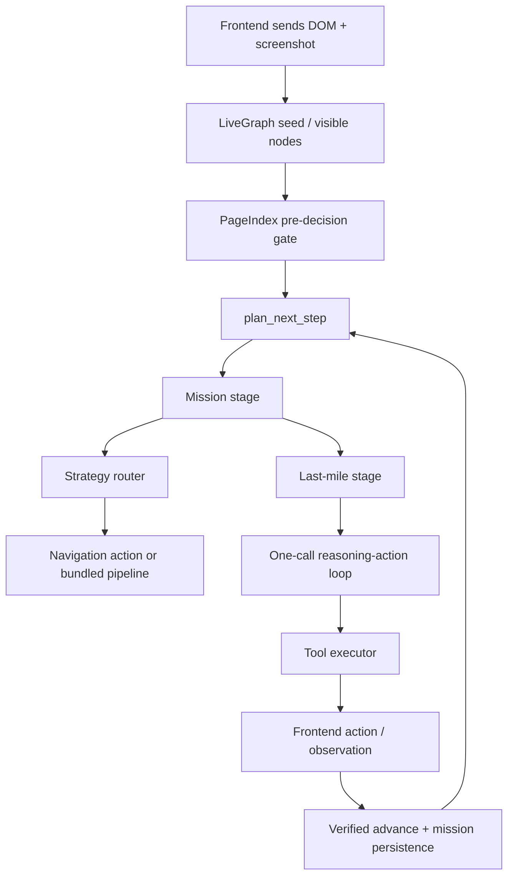

# Visual Copilot Workflow Architecture

This document describes the current end-to-end workflow for the `rag-visual-copilot` stack, with emphasis on the active orchestration path, mission state handling, PageIndex navigation, last-mile reasoning, and the current known weak points.

## Scope

This file covers the runtime flow centered around:

- `/Users/amar/demo.davinciai/rag-visual-copilot/visual_copilot/orchestration/plan_next_step_flow.py`
- `/Users/amar/demo.davinciai/rag-visual-copilot/visual_copilot/orchestration/stages/mission_stage.py`
- `/Users/amar/demo.davinciai/rag-visual-copilot/visual_copilot/orchestration/stages/last_mile_stage.py`
- `/Users/amar/demo.davinciai/rag-visual-copilot/visual_copilot/mission/last_mile.py`
- `/Users/amar/demo.davinciai/rag-visual-copilot/visual_copilot/mission/tool_executor.py`
- `/Users/amar/demo.davinciai/rag-visual-copilot/visual_copilot/mission/verified_advance.py`
- `/Users/amar/demo.davinciai/rag-visual-copilot/site_map.json`

## High-Level Flow

## Main Runtime Stages

### 1. Input acquisition

The frontend provides:

- current DOM snapshot
- screenshot via `push_screenshot`
- visible node graph via `livegraph_seed`
- user goal
- session and action history context

The backend normalizes this into a `LiveGraph` view of visible and interactive nodes.

### 2. Pre-decision routing

`plan_next_step_flow.py` performs a fast routing pass:

- resolves the current URL with PageIndex
- computes a target node from `site_map.json`
- creates a short navigation strategy if the goal is clearly on a mapped path

Typical result:

- `Click Dashboard`
- `Click Usage`
- terminal last-mile goal

### 3. Mission stage

`mission_stage.py` is responsible for:

- loading or creating the mission
- reconciling action history
- verifying pending actions
- advancing subgoals when effects are observed
- forcing transition into last-mile when the final subgoal is extraction

### 4. Strategy routing

If the mission is still in navigation:

- keyword direct routing is tried first
- lexical / detective fallback can be used if direct label grounding fails
- PageIndex can return a bundled nav pipeline when all intermediate targets are visible

### 5. Last-mile stage

When the mission reaches the terminal extraction subgoal:

- last-mile enters with mission context, DOM summary, readable content, and PageIndex node context
- optional one-time vision bootstrap runs on entry
- one-call reasoning-action tries to return a single validated action or pipeline
- observation-only tools can feed evidence back into the loop

### 6. Tool execution

`tool_executor.py` handles:

- `click_element`
- `type_text`
- `scroll_page`
- `wait_for_ui`
- `read_page_content`
- `request_vision`
- `complete_mission`

Tools produce either:

- a frontend action to execute
- an observation string to continue reasoning with
- a terminal success/failure outcome

### 7. Verified advance

`verified_advance.py` checks whether the previous action had an observable effect using:

- URL changes
- DOM signature changes
- target state changes
- expanded/flyout state changes
- interactive node count changes

This determines whether the mission:

- advances
- retries
- drops the pending action
- or optimistically advances after repeated invisible effects

## Current State of the System

### What is working

- service startup and dependency initialization
- LiveGraph seeding
- PageIndex routing from `site_map.json`
- mission creation and Redis-backed persistence
- transition into last-mile
- one-call last-mile mode
- observation-first vision prompting
- observation-only tool handling inside the one-call loop

### What has recently been fixed

- constrained one-call fallback no longer crashes from an undefined `execute_internal_tool`
- bundled PageIndex navigation now stages the final bundled click as a pending verified action
- one-call observational results like `read_page_content` no longer immediately fall through to constrained fallback
- vision is used more as an observer than as a rigid planner

### What is still weak

- last-mile still overuses `read_page_content` and `scroll_page` when it cannot ground the right control
- label-to-DOM grounding for controls like `Date Picker`, `Model Filter`, and `Activity Tab` is still weak
- retry prompts are still expensive and can lead to repeated low-value loops
- legacy last-mile fallback can still re-enter when one-call validation fails repeatedly
- verified advance still relies heavily on DOM-observable effects, which is fragile for UI state that changes without obvious URL or signature deltas

## Bundled Navigation Semantics

Bundled PageIndex navigation is used only when all visible intermediate targets can be grounded in the current DOM.

Current intended behavior:

1. earlier bundled clicks are recorded in mission history
2. the final bundled click is staged as `pending_action`
3. the next request verifies that final click using URL/DOM effects
4. successful verification advances into the next subgoal or last-mile

This is designed to prevent replaying the first bundled step on the next request.

## Last-Mile One-Call Contract

The active last-mile path is:

1. build compact runtime prompt
2. ask the reasoning model for one structured decision
3. validate action against DOM, PageIndex, and mission state
4. execute action or consume observation
5. continue until a frontend action or terminal result is produced

Important distinction:

- `request_vision` is advisory evidence gathering
- `read_page_content` is observational
- backend validation remains the final authority on action safety

## Vision Design

Vision is currently intended to act as:

- a perceptual observer
- an ambiguity detector
- a source of ranked candidate controls
- a cross-check for whether answer evidence is visibly present

Vision is not intended to be:

- the final executor
- the exact DOM id selector of record
- the sole completion authority

## Key Files by Responsibility

### Orchestration

- `/Users/amar/demo.davinciai/rag-visual-copilot/visual_copilot/orchestration/plan_next_step_flow.py`
- `/Users/amar/demo.davinciai/rag-visual-copilot/visual_copilot/orchestration/stages/mission_stage.py`
- `/Users/amar/demo.davinciai/rag-visual-copilot/visual_copilot/orchestration/stages/last_mile_stage.py`

### Mission logic

- `/Users/amar/demo.davinciai/rag-visual-copilot/visual_copilot/mission/last_mile.py`
- `/Users/amar/demo.davinciai/rag-visual-copilot/visual_copilot/mission/tool_executor.py`
- `/Users/amar/demo.davinciai/rag-visual-copilot/visual_copilot/mission/verified_advance.py`
- `/Users/amar/demo.davinciai/rag-visual-copilot/visual_copilot/mission/screenshot_broker.py`

### Mission persistence

- `/Users/amar/demo.davinciai/rag-visual-copilot/mission_brain.py`

### Page map

- `/Users/amar/demo.davinciai/rag-visual-copilot/site_map.json`

## Known Failure Modes

### 1. Repeated nav clicks

Cause:

- pending action not staged or not verified correctly

Symptom:

- repeated `Click Dashboard` or `Click Usage`

### 2. Observation loops in last-mile

Cause:

- evidence gathering succeeds, but the next action cannot be grounded

Symptom:

- `read_page_content` followed by `scroll_page` or repeated retry

### 3. Weak control grounding

Cause:

- vision sees a control semantically but cannot map it cleanly to a live DOM id

Symptom:

- model chooses the right concept but backend rejects the target as not clickable or unexpected

### 4. Legacy fallback re-entry

Cause:

- one-call validation or retry still fails after bounded attempts

Symptom:

- system falls back to legacy plan-last-mile behavior

## Recommended Next Improvements

1. Add a deterministic label-to-DOM grounding layer for expected PageIndex controls.
2. Reduce one-call retry prompt size and make correction prompts more target-specific.
3. Add semantic page-state fingerprints for stability instead of leaning on raw DOM signatures.
4. Add a mission visit log so cross-page evidence survives transitions more cleanly.
5. Add structured escalation instead of generic `clarify` or repeated probing.

## Status Summary

As of the current implementation:

- architecture direction is correct
- navigation is mostly solid
- one-call last-mile is active
- the system is not yet fully stable in production

The main remaining problem area is last-mile control grounding on complex dashboard UIs.
